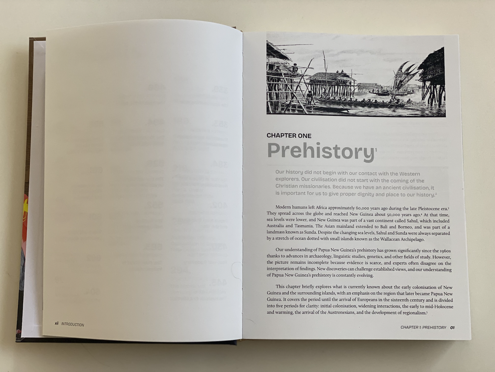

# A History of Papua New Guinea – Project Site

This repository powers the promotional site for Eric Johns’ book *A History of Papua New Guinea from Prehistory to Independence*. The live site is available at **http://eric.johns.com.au**.

## What’s on the site

- **Hero & Overview** – introduces the book launch and the mission to place copies in PNG classrooms.
- **The Book** – highlights the 635-page volume, chapter previews, and publication journey.
- **Support** – form for sponsors, educators, and community members to register interest.
- **Meet the People** – profiles of Eric Johns, publisher Chris Roering, and UPNG lecturer Keimelo Gima.
- **Videos** – embedded YouTube series featuring PNG history segments.

All of the storytelling content is written in Markdown under `src/content/sections`, making updates straightforward without touching layout files.

## Visual preview

| Hero banner | Book interior | Support form |
|-------------|---------------|--------------|
|  |  |  |

| Author profile | Additional titles | Transparent promo |
|----------------|-------------------|-------------------|
|  |  |  |

## Local development

```bash
npm install
npm run dev
```

Visit `http://localhost:4321/` to preview changes with hot reload.

### Production build

```bash
npm run build
npm run preview
```

Static assets are written to `dist/` and deployed via GitHub Actions to GitHub Pages.

## Tech stack

Built with [Astro](https://astro.build), [Tailwind CSS](https://tailwindcss.com), and [TypeScript](https://www.typescriptlang.org/). Continuous deployment uses GitHub Actions and GitHub Pages.


## Channel JS script

Get the contents of the channel in JSON format.

```javascript
console.log(JSON.stringify(Array.from(document.querySelectorAll('a#video-title-link')).map(v => ({ title: v.innerText.trim(), link: 'https://www.youtube.com' + v.getAttribute('href') })), null, 2));
```

```json

```